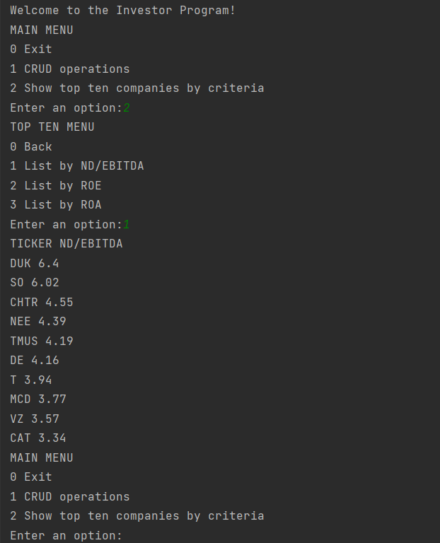

# Investor-Calulator

The investor calculator is a project that aims to help investors to decide what companies are the best for investing

The current MVP only supports Console interaction

## Python
The project was written using v3.7.15

## Features

### Batch data insertions
The Database can be populated using .csv files

### CLI Tool
- CRUD OPERATIONS
- Find the TOP 10 Companies based on the following investment metrics:
    - ROE
    - ROA
    - NET DEBT / EBITDA

**Example Usage**

